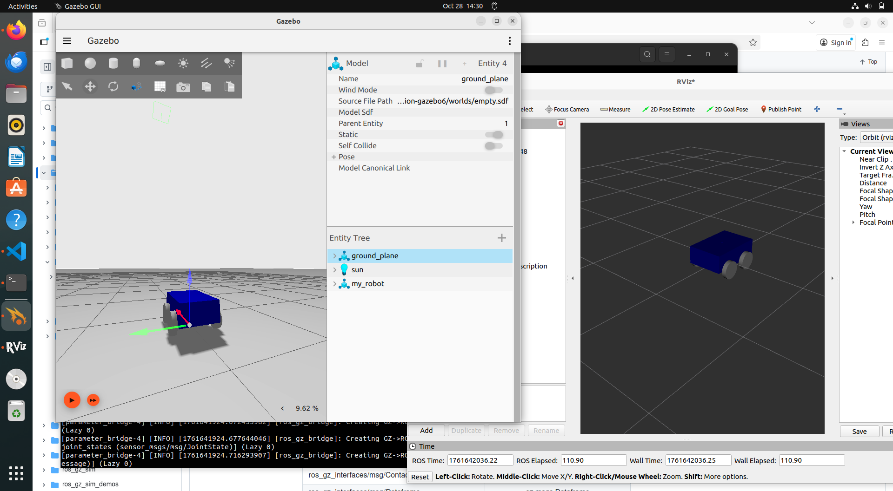
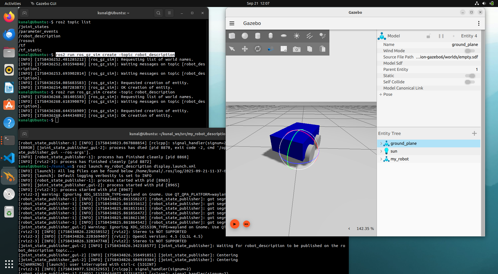

# 🤖 NEXABOT — The Four-Wheeled ROS2 Explorer

Welcome to **NEXABOT**, a simulated **4-wheel mobile robot** built using **ROS2**, **Gazebo Fortress**, and **RViz2**.  
Crafted with precision by *Kunal*, this project bridges imagination and simulation — a stepping stone toward robotics mastery.

---

## 🧩 Project Structure

Here’s the layout of my workspace — everything built and organized with intention.

```bash
kunal_ws/
├── src/
│   ├── my_robot_description/                # Contains robot description (URDF + RViz launch)
│   │   ├── urdf/
│   │   │   └── my_robot.urdf.xacro
│   │   └── launch/
│   │       └── display.launch.xml
│   ├── my_robot_bringup/                   # Contains Gazebo world + ROS-Gazebo bridge
│   │   ├── launch/
│   │   │   └── my_robot_gazebo.launch.xml
│   │   └── worlds/
│   │       └── empty.world
├── install/                                # Auto-generated by colcon build
├── build/
└── log/


````

---

## ⚙️ Setup & Installation

Before running TERRABOT, ensure that you have:
- **ROS2 Humble (or later)** installed  
- **Gazebo Fortress / Garden** installed and working  
- All dependencies sourced correctly  

Clone the repository and build:

```bash
cd ~/kunal_ws/src
git clone <your_repo_link_here>
cd ..
colcon build
source install/setup.bash
````

---

## 🚀 How to Run

Run the robot step-by-step:

### 🧩 Step 1: Launch the URDF in RViz

Visualize your robot’s model and transforms:

```bash
ros2 launch my_robot_description display.launch.xml
```

### 🌍 Step 2: Launch the Simulation in Gazebo

Bring the robot to life in the virtual world:

```bash
ros2 launch my_robot_bringup my_robot_gazebo.launch.xml
```

### 🔗 Step 3: Bridge Gazebo with ROS2 Topics

Enable real-time communication between Gazebo and ROS2:

```bash
ros2 launch my_robot_bringup ros_gazebo_bridge.launch.xml
```

### 🕹️ Step 4: Control and Experiment

Use teleop or custom scripts to move your TERRABOT around your simulated world.

---

## 🧠 Key Features

* 🦾 **4-Wheel Differential Drive** robot
* 🪞 **Accurate URDF model** for visualization
* 🌐 **Gazebo simulation** for realistic motion
* 🔁 **ROS2 bridge** for topic communication
* 🧩 **Modular launch system** for flexibility
* 🎨 **Beautifully structured workspace** for learning and growth

---

## 🖼️ Visualization

| RViz View                                | Gazebo Simulation                            |
| ---------------------------------------- | -------------------------------------------- |
|  |  |

🎬 [Watch simulation video](Photos/SIMULATION.webm)


---

## 🪄 Future Enhancements

* Add **LIDAR** and **Camera sensors**
* Implement **Navigation Stack (Nav2)**
* Integrate **SLAM** for autonomous exploration
* Add **PID motion control** for precision

---

## 💬 About the Creator

Developed by **Kunal** — an aspiring **Robotics Software Engineer** who believes in learning by building.
TERRABOT isn’t just a robot; it’s a dream in motion, a symbol of persistence and the joy of creation.

> *"Every robot begins with curiosity — and ends with creation."* ✨

---

## 🛠️ Tech Stack

| Component     | Technology        |
| ------------- | ----------------- |
| Framework     | ROS2 Humble       |
| Simulation    | Gazebo Fortress   |
| Visualization | RViz2             |
| Language      | Python, XML, URDF |
| OS            | Ubuntu 22.04 LTS  |

---

## 🌟 Contribute

Want to make TERRABOT even more capable?
Fork this repo, enhance the robot, and submit a pull request.
Every improvement takes this little explorer a step closer to the real world! 🚗💨

---

## 🧾 License

This project is licensed under the **MIT License** — free to use, modify, and learn from.

---

### 🪐 Final Words

> TERRABOT is not just a 4-wheel robot — it’s your first companion in the vast cosmos of robotics simulation.
> From a blank workspace to a breathing virtual machine — it stands as a testament to learning, effort, and love for creation. 💖

---

🌟 **Created with passion by Kunal | ROS2 • Robotics • Imagination**

```

---

Would you like me to make a **banner image** (like a header with “TERRABOT – ROS2 4-Wheel Robot”) for the top of this README too, so it looks professional when uploaded to GitHub?
```
